# AI-Driven Travel Itinerary Planner

An intelligent, enterprise-grade weekend travel planner that solves the manual, time-intensive process of finding optimal getaway itineraries. This platform leverages real-time web search grounding, integrates a real-time LLM-as-a-judge evaluation layer, implements persistent context with the Google Agent Memory Bank, incorporates a Human-in-the-Loop (HITL) administrator approval dashboard, and deploys using `agents-cli` to Google Cloud Agent Runtime.

---

## ⚙️ Operational Flow Architecture

The following sequence diagram details how the application works end-to-end—from the user's initial input, context loading via the Google Agent Memory Bank, real-time agent-evaluation loops with Google Search grounding, state persistence in Firestore, through the Human-in-the-Loop admin gateway and final real-time UI polling resolution.

```mermaid
sequenceDiagram
    autonumber
    actor Client as Client (User)
    actor Admin as Administrator
    participant FE as Frontend UI (Vite/Vanilla)
    participant BE as FastAPI Backend (orchestrator.py)
    participant DB as Google Cloud Firestore
    participant AMB as Google Agent Memory Bank
    participant PA as Primary Agent (Gemini 3.1 Pro)
    participant GS as Google Search Tool
    participant EA as Evaluator Judge (Gemini 3.5 Flash)

    %% 1. Request & Context
    Client->>FE: Inputs itinerary preferences
    FE->>BE: POST /api/itinerary (Asynchronous Request)
    BE->>AMB: Fetch short-term history & long-term user preferences
    AMB-->>BE: Return profile context

    %% 2. Orchestrated Generation Loop
    rect rgb(30, 40, 50)
        note right of BE: Evaluation Feedback Loop (max_retries = 3)
        BE->>PA: Initiate planning with criteria & user preferences
        loop Google Search Grounding
            PA->>GS: Search flights, hotels, weather, & activities
            GS-->>PA: Return real-time live travel data
        end
        PA-->>BE: Proposed Itinerary Draft
        BE->>EA: Grade proposal for feasibility, budget & constraints
        EA-->>BE: Score & structured feedback (Pass/Fail)
    end

    %% 3. State Persistence
    BE->>DB: Save itinerary with 'pending_approval' status & evaluation score
    BE-->>FE: Return task tracking ID
    FE->>BE: Continuous Async Polling (Status: "pending_approval")

    %% 4. Human-In-The-Loop Approval Flow
    Admin->>FE: View Admin Dashboard
    FE->>BE: GET /api/admin/pending
    BE->>DB: Query 'pending_approval' records
    DB-->>BE: Return pending proposals
    BE-->>FE: Populate Admin Dashboard list
    Admin->>FE: Click "Approve Itinerary"
    FE->>BE: POST /api/admin/approve/{id}
    BE->>DB: Update status to 'approved'
    DB-->>BE: Confirmation

    %% 5. Real-Time UI Resolution
    FE->>BE: Poll /api/itinerary/{id}
    BE->>DB: Get 'approved' itinerary
    DB-->>BE: Return itinerary details
    BE-->>FE: Status resolved to 'approved'
    FE->>Client: Render premium itinerary carousel
```

---

## 🎯 Evaluation Criteria Fulfillment

This project is built to fully address and satisfy the core evaluation parameters:

### 1. 🛠️ Tool & Interface Design
* **Premium Frontend SPA**: Built with Vanilla HTML/JS/CSS utilizing high-end aesthetic tokens (glassmorphism, curated HSL dark-theme palette, and subtle micro-animations) for a premium user experience.
* **Latency-Aware Polling**: Features asynchronous state-tracking polling so the client sees real-time agent operations (e.g., `"Querying Google Search..."`, `"Evaluating constraints..."`) without interface freezing.
* **Google Search Tool Grounding**: Uses the ADK's built-in Google Search tool to ground itinerary creation with live, real-time travel flight availability, hotel tariffs, and local attractions. It implements a robust Pydantic fallback mechanism to cleanly handle tool timeouts or budget conflicts.

### 2. 🧠 Context & Memory
* **Google Agent Memory Bank**: Out-of-the-box native context management that avoids messy session bloat in the operational database.
* **Short-Term Session History**: Natively records full message history to permit iterative conversational requests.
* **Long-Term Preference Profiles**: Remembers and applies specific traveler profiles (e.g., airline alliance choices, dietary restrictions, accommodation tiers) across unique sessions for highly tailored itinerary plans.

### 3. 🔄 Orchestration & Logic
* **Generative-Evaluator Loop**: Coordinates Gemini 3.1 Pro (Primary Agent) and Gemini 3.5 Flash (LLM-as-a-judge Evaluator) in a self-correcting orchestrator loop that refines itineraries up to `max_retries` with direct grading feedback.
* **Human-in-the-Loop (HITL) Gateway**: Implements a dedicated Admin Dashboard. All itineraries must receive manual authorization from an administrator before being marked `approved` in Firestore and visible to the client.

### 4. 📊 Observability & Tracing
* **Trace Analytics**: Produces rich trace JSON summaries capturing exact prompt context, search queries, tool outputs, and LLM-as-a-judge scores.
* **Google Cloud Observability**: Natively hooks into GCP Cloud Trace, Cloud Logging, and BigQuery Agent Analytics to monitor execution timelines and debug latency bottlenecks.

### 5. 🚀 Infrastructure & CI/CD
* **Terraform IaC**: Infrastructure is fully declared and provisioned via Terraform, managing GCP Firestore, Cloud Storage buckets, and IAM Service Accounts with narrow-scope access controls.
* **Containerized Deployment**: Utilizes an optimized, lightweight `Dockerfile` packaged and deployed directly to Google Cloud Agent Runtime on Vertex AI via `agents-cli deploy`.
* **Offline Regression Evaluators**: Implements automated testing using `agents-cli eval` to evaluate accuracy and prevent regressions using a robust, custom `.evalset.json` test suite.

