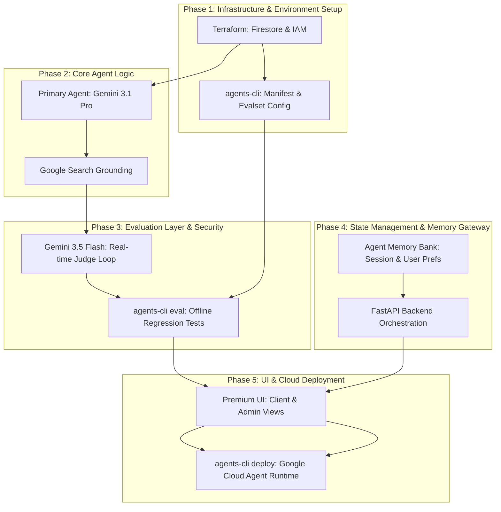

# AI-Driven Travel Itinerary Planner

An intelligent, enterprise-grade weekend travel planner that solves the manual, time-intensive process of finding optimal getaway itineraries. This platform leverages real-time web search grounding, integrates a real-time LLM-as-a-judge evaluation layer, implements persistent context with the Google Agent Memory Bank, incorporates a Human-in-the-Loop (HITL) administrator approval dashboard, and deploys using `agents-cli`.

---

## 🗺️ Phase-by-Phase Roadmap

---

## 🛠️ Detailed Roadmap Phases

### Phase 1: Environment Setup & Infrastructure
*   Configure Google Cloud Platform base APIs and services.
*   **Infrastructure as Code (IaC)**: Deploy base database (Firestore) and IAM service accounts using Terraform.
*   Initialize backend structure, Python dependencies, and `agents-cli-manifest.yaml` configuration.

### Phase 2: Core Agent Logic (Primary Agent)
*   Build the primary planning agent using Gemini 3.1 Pro via the ADK.
*   Integrate the built-in **Google Search tool** for real-time web grounding of flights, hotels, and tourist attractions.
*   Implement a robust fallback schema (`fallback_requested` and `fallback_message`) in Pydantic to cleanly handle tool timeouts, budget limitations, or impossible criteria.

### Phase 3: Evaluation Layer (LLM-as-a-Judge) & Security
*   **Real-time Evaluator Loop**: Implement a Gemini 3.5 Flash judge model that scores proposals for feasibility, budget compliance, and constraints, returning a feedback prompt to the primary agent up to a maximum number of retries (`max_retries`).
*   **Offline/CI-CD Evaluation**: Set up `.evalset.json` datasets and use `agents-cli eval run` to quantitatively check overall agent accuracy and prevent prompt/logic regression before committing.
*   **Security Guardrails**: Apply Vertex AI Safety Settings and strict backend input sanitization.

### Phase 4: State Management & Memory Gateway
*   **Google Agent Memory Bank**: Connect the agent to Google's managed Memory Bank for both short-term active session chat histories and long-term user preferences (e.g., diet, airline brands, hotel class).
*   **HITL Database Orchestration**: Store travel requests, pending admin approvals, and final approved itineraries in separate Firestore collections.
*   **FastAPI API Gateway**: Build standard routes to accept user queries, trigger background agent workflow routines, fetch pending queues for admins, and write approvals.

### Phase 5: Frontend UI Development & Cloud Deployment
*   **Client Planner View**: A modern, premium portal enabling users to enter preferences, track live agent steps via polling (e.g., `"Querying Google Search..."`, `"Grading proposals..."`), and view approved itineraries in an interactive carousel.
*   **Admin Dashboard**: A secure administrative control screen to fetch pending proposals, review evaluator grades, and approve or reject submissions.
*   **Vanilla CSS Styling**: Use premium dark mode styles, custom transitions, glassmorphism containers, and typography.
*   **Cloud Deployment**: Package and deploy the agent container directly to Google Cloud Agent Runtime / Cloud Run via `agents-cli deploy`.
